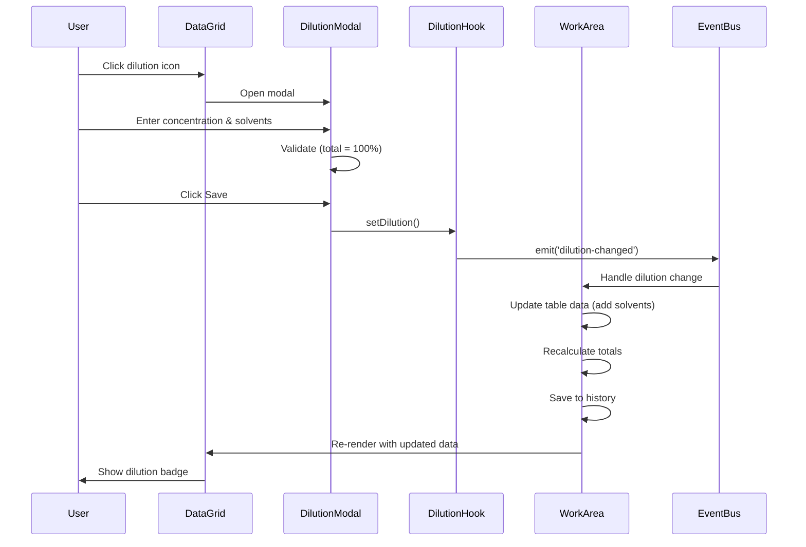

# Dilution Feature

## Overview

The Dilution feature allows perfumers to dilute concentrated ingredients with solvents to achieve desired concentrations. This is essential for working with expensive raw materials, controlling odor intensity, and creating more precise formulations.

## User Stories

### US-080: Add Dilution to Ingredient

**As a** perfumer  
**I want to** dilute an ingredient with a solvent  
**So that** I can work with a more manageable concentration

**Acceptance Criteria:**

- Dilution icon (droplet) visible in ingredient row
- Click dilution icon opens dilution modal
- Select solvent from dropdown
- Enter dilution concentration (1-99%)
- System calculates actual ingredient and solvent amounts
- Dilution badge shows concentration (e.g., "10%")
- Dilution icon changes color when active
- Save button applies dilution
- Formula totals recalculate to include solvent

---

### US-081: View Dilution Details

**As a** perfumer  
**I want to** see dilution information for an ingredient  
**So that** I know the actual concentration

**Acceptance Criteria:**

- Dilution badge displayed in cell
- Badge shows: concentration percentage
- Hover shows tooltip with full details:
  - Original ingredient amount
  - Solvent name
  - Solvent amount
  - Final concentration
- Badge color indicates dilution strength:
  - Light blue: 50-99%
  - Medium blue: 20-49%
  - Dark blue: 1-19%

---

### US-082: Edit Dilution

**As a** perfumer  
**I want to** modify dilution settings  
**So that** I can adjust concentration

**Acceptance Criteria:**

- Click dilution badge or icon to edit
- Modal shows current settings
- Can change solvent
- Can change concentration
- Changes recalculate immediately
- Save updates dilution
- Formula totals recalculate
- Undo available for changes

---

### US-083: Remove Dilution

**As a** perfumer  
**I want to** remove dilution from an ingredient  
**So that** I can use it at full strength

**Acceptance Criteria:**

- "Remove Dilution" button in modal
- Confirmation dialog appears
- Confirm removes dilution and solvent
- Ingredient returns to original amount
- Badge removed from cell
- Icon returns to inactive state
- Formula totals recalculate
- Undo available

---

### US-084: Multiple Solvents Selection

**As a** perfumer  
**I want to** use multiple solvents in a dilution  
**So that** I can create custom solvent blends

**Acceptance Criteria:**

- "Add Solvent" button in modal
- Can select up to 3 solvents
- Enter percentage for each solvent
- Total solvent percentages must equal (100 - ingredient %)
- System validates total equals 100%
- Each solvent shown with its percentage
- Can remove individual solvents
- Save applies multi-solvent dilution

---

### US-085: Dilution Calculation Display

**As a** perfumer  
**I want to** see dilution calculations in real-time  
**So that** I understand the amounts

**Acceptance Criteria:**

- Modal shows live calculations:
  - Target ingredient %: entered by user
  - Ingredient amount: calculated
  - Each solvent %: entered by user
  - Each solvent amount: calculated
  - Total: must equal 100%
- Values update as user types
- Validation errors shown immediately
- Color coding for valid/invalid state

---

## Technical Implementation

### File Structure

| File Path | Responsibility | Lines |
|-----------|---------------|-------|
| `src/components/dilution/DilutionModal.tsx` | Dilution configuration UI | ~300 |
| `src/components/dilution/DilutionBadge.tsx` | Badge display component | ~80 |
| `src/components/dilution/DilutionIcon.tsx` | Icon component | ~50 |
| `src/components/dilution/useDilution.ts` | Dilution state hook | 100 |
| `src/components/dilution/index.ts` | Exports | ~20 |
| `src/types/dilution.ts` | Type definitions | ~50 |
| `src/mocks/solvents.ts` | Solvent data | ~100 |

### Data Models

```typescript
// Dilution Configuration
interface Dilution {
  ingredientId: string;            // Reference to ingredient
  concentration: number;           // Target ingredient % (1-99)
  solventIds: string[];            // Array of solvent IDs
  solventPercentages: Record<string, number>; // Solvent ID -> percentage
  totalPercentage: number;         // Should always be 100
}

// Solvent
interface Solvent {
  id: string;                      // Unique identifier
  name: string;                    // Solvent name
  code: string;                    // Solvent code
  type: 'alcohol' | 'oil' | 'glycol' | 'water';
  price: number;                   // Price per kg
  description?: string;            // Description
}

// Dilution State
interface DilutionState {
  [ingredientId: string]: Dilution;
}
```

### Hook API

```typescript
// useDilution Hook
export interface UseDilutionReturn {
  dilutions: DilutionState;
  getDilution: (ingredientId: string) => Dilution | undefined;
  setDilution: (ingredientId: string, dilution: Dilution) => void;
  removeDilution: (ingredientId: string) => void;
  hasDilution: (ingredientId: string) => boolean;
  clearAllDilutions: () => void;
  restoreDilutions: (savedDilutions: DilutionState) => void;
}

// Usage
const dilutionState = useDilution();

// Check if ingredient has dilution
if (dilutionState.hasDilution(ingredientId)) {
  const dilution = dilutionState.getDilution(ingredientId);
  // Display dilution info
}

// Set dilution
dilutionState.setDilution(ingredientId, {
  ingredientId,
  concentration: 10,
  solventIds: ['SOLV001'],
  solventPercentages: { 'SOLV001': 90 },
  totalPercentage: 100,
});

// Remove dilution
dilutionState.removeDilution(ingredientId);
```

### Key Operations

#### 1. Add Dilution

```typescript
const handleSaveDilution = () => {
  // Validate
  if (concentration <= 0 || concentration >= 100) {
    toast.error('Concentration must be between 1 and 99%');
    return;
  }

  const totalSolventPercentage = Object.values(solventPercentages).reduce(
    (sum, pct) => sum + pct,
    0
  );

  if (Math.abs(totalSolventPercentage + concentration - 100) > 0.01) {
    toast.error('Total must equal 100%');
    return;
  }

  // Create dilution object
  const dilution: Dilution = {
    ingredientId,
    concentration,
    solventIds,
    solventPercentages,
    totalPercentage: 100,
  };

  // Save to state
  dilutionState.setDilution(ingredientId, dilution);

  // Close modal
  onClose();

  toast.success(`Dilution applied: ${concentration}% solution`);
};
```

#### 2. Calculate Diluted Amounts

```typescript
const calculateDilutedAmounts = (
  originalAmount: number,
  dilution: Dilution
) => {
  // Original amount is the total solution amount
  // Calculate actual ingredient amount
  const ingredientAmount = (originalAmount * dilution.concentration) / 100;

  // Calculate solvent amounts
  const solventAmounts: Record<string, number> = {};
  dilution.solventIds.forEach((solventId) => {
    const percentage = dilution.solventPercentages[solventId];
    solventAmounts[solventId] = (originalAmount * percentage) / 100;
  });

  return {
    ingredientAmount,
    solventAmounts,
    totalAmount: originalAmount,
  };
};
```

#### 3. Apply Dilution to Formula

When dilution is applied, the formula data needs to be updated to include solvent rows:

```typescript
const applyDilutionToFormula = (
  ingredientId: string,
  dilution: Dilution,
  tableData: any[],
  columns: Column[]
) => {
  // Find ingredient row
  const ingredientRow = tableData.find(
    (row) => row.id === ingredientId && !row.isTotal
  );
  if (!ingredientRow) return tableData;

  // Get ingredient value for active formula
  const activeFormulaId = editableFormula;
  if (!activeFormulaId) return tableData;

  const originalValue = parseFloat(ingredientRow[activeFormulaId]) || 0;
  if (originalValue === 0) return tableData;

  // Calculate amounts
  const { ingredientAmount, solventAmounts } = calculateDilutedAmounts(
    originalValue,
    dilution
  );

  // Create solvent rows
  const solventRows = dilution.solventIds.map((solventId) => {
    const solvent = solvents.find((s) => s.id === solventId);
    if (!solvent) return null;

    return {
      id: `${ingredientId}_solvent_${solventId}`,
      description: `${solvent.name} (solvent)`,
      costKg: solvent.price,
      type: 'solvent',
      isDilutionSolvent: true,
      parentIngredientId: ingredientId,
      [activeFormulaId]: solventAmounts[solventId],
    };
  }).filter(Boolean);

  // Update ingredient row with actual amount
  const updatedIngredientRow = {
    ...ingredientRow,
    [activeFormulaId]: ingredientAmount,
  };

  // Insert solvent rows after ingredient
  const ingredientIndex = tableData.findIndex((row) => row.id === ingredientId);
  const updatedData = [
    ...tableData.slice(0, ingredientIndex),
    updatedIngredientRow,
    ...solventRows,
    ...tableData.slice(ingredientIndex + 1),
  ];

  return updatedData;
};
```

#### 4. Remove Dilution

```typescript
const removeDilutionFromFormula = (
  ingredientId: string,
  tableData: any[],
  dilutionState: UseDilutionReturn
) => {
  // Get dilution info
  const dilution = dilutionState.getDilution(ingredientId);
  if (!dilution) return tableData;

  // Find ingredient row
  const ingredientRow = tableData.find((row) => row.id === ingredientId);
  if (!ingredientRow) return tableData;

  // Calculate original (undiluted) value
  const activeFormulaId = editableFormula;
  if (!activeFormulaId) return tableData;

  const currentIngredientAmount = parseFloat(ingredientRow[activeFormulaId]) || 0;
  const originalAmount = (currentIngredientAmount * 100) / dilution.concentration;

  // Update ingredient row
  const updatedIngredientRow = {
    ...ingredientRow,
    [activeFormulaId]: originalAmount,
  };

  // Remove solvent rows
  const updatedData = tableData
    .filter((row) => row.parentIngredientId !== ingredientId)
    .map((row) => (row.id === ingredientId ? updatedIngredientRow : row));

  // Remove from dilution state
  dilutionState.removeDilution(ingredientId);

  return updatedData;
};
```

### UI Components

#### DilutionModal

```typescript
const DilutionModal = ({
  isOpen,
  onClose,
  ingredientId,
  ingredientName,
  initialDilution,
  onSave,
}: DilutionModalProps) => {
  const [concentration, setConcentration] = useState(initialDilution?.concentration || 10);
  const [selectedSolvents, setSelectedSolvents] = useState<string[]>(
    initialDilution?.solventIds || []
  );
  const [solventPercentages, setSolventPercentages] = useState<Record<string, number>>(
    initialDilution?.solventPercentages || {}
  );

  // Calculate remaining percentage
  const usedPercentage = concentration + Object.values(solventPercentages).reduce((sum, pct) => sum + pct, 0);
  const remainingPercentage = 100 - usedPercentage;

  return (
    <Modal isOpen={isOpen} onClose={onClose} title={`Dilute ${ingredientName}`}>
      <div className="space-y-4">
        {/* Ingredient Concentration */}
        <div>
          <label>Ingredient Concentration (%)</label>
          <input
            type="number"
            min="1"
            max="99"
            value={concentration}
            onChange={(e) => setConcentration(Number(e.target.value))}
          />
        </div>

        {/* Solvents */}
        <div>
          <label>Solvents</label>
          {selectedSolvents.map((solventId) => (
            <div key={solventId} className="flex gap-2">
              <select
                value={solventId}
                onChange={(e) => {
                  // Update solvent
                }}
              >
                {solvents.map((s) => (
                  <option key={s.id} value={s.id}>{s.name}</option>
                ))}
              </select>
              <input
                type="number"
                value={solventPercentages[solventId] || 0}
                onChange={(e) => {
                  setSolventPercentages({
                    ...solventPercentages,
                    [solventId]: Number(e.target.value),
                  });
                }}
              />
              <button onClick={() => removeSolvent(solventId)}>Remove</button>
            </div>
          ))}
          <button onClick={addSolvent}>Add Solvent</button>
        </div>

        {/* Summary */}
        <div className="bg-gray-50 p-4 rounded">
          <div>Ingredient: {concentration}%</div>
          {selectedSolvents.map((id) => (
            <div key={id}>
              {solvents.find((s) => s.id === id)?.name}: {solventPercentages[id]}%
            </div>
          ))}
          <div className="font-bold">
            Total: {usedPercentage}%
            {Math.abs(usedPercentage - 100) < 0.01 ? (
              <span className="text-green-600"> ✓</span>
            ) : (
              <span className="text-red-600"> (must equal 100%)</span>
            )}
          </div>
        </div>

        {/* Actions */}
        <div className="flex gap-2 justify-end">
          <button onClick={onClose}>Cancel</button>
          <button onClick={handleSave} disabled={Math.abs(usedPercentage - 100) > 0.01}>
            Save Dilution
          </button>
        </div>
      </div>
    </Modal>
  );
};
```

#### DilutionBadge

```typescript
const DilutionBadge = ({ dilution, onClick }: DilutionBadgeProps) => {
  const getColorClass = (concentration: number) => {
    if (concentration >= 50) return 'bg-blue-100 text-blue-800';
    if (concentration >= 20) return 'bg-blue-200 text-blue-900';
    return 'bg-blue-300 text-blue-950';
  };

  return (
    <span
      onClick={onClick}
      className={`inline-flex items-center px-2 py-0.5 rounded text-xs font-medium cursor-pointer ${getColorClass(dilution.concentration)}`}
      title={`Diluted to ${dilution.concentration}%`}
    >
      <i className="ri-drop-line mr-1"></i>
      {dilution.concentration}%
    </span>
  );
};
```

### Integration with DataGrid

The dilution state is passed to DataGrid as a prop:

```typescript
<DataGrid
  columns={columns}
  data={tableData}
  dilutionState={dilutionState}
  // ... other props
/>
```

In CellRenderer, dilution badges are displayed:

```typescript
const CellRenderer = ({ value, row, column, dilutionState }: CellRendererProps) => {
  const hasDilution = dilutionState?.hasDilution(row.id);
  const dilution = dilutionState?.getDilution(row.id);

  return (
    <div className="flex items-center justify-between">
      <span>{value}</span>
      {hasDilution && dilution && (
        <DilutionBadge
          dilution={dilution}
          onClick={() => openDilutionModal(row.id)}
        />
      )}
    </div>
  );
};
```

### Event Flow



### Related Features

- [Ingredient Management](./INGREDIENT_MANAGEMENT.md) - Diluting ingredients
- [Formula Management](./FORMULA_MANAGEMENT.md) - Formulas with dilutions
- [DataGrid Operations](./DATAGRID_OPERATIONS.md) - Display dilution badges
- [State History](./STATE_HISTORY.md) - Undo dilution changes

### Testing Checklist

- [ ] Open dilution modal
- [ ] Enter valid concentration (1-99%)
- [ ] Add single solvent
- [ ] Add multiple solvents
- [ ] Remove solvent
- [ ] Save dilution with valid total (100%)
- [ ] Attempt save with invalid total (should fail)
- [ ] View dilution badge in grid
- [ ] Hover dilution badge for tooltip
- [ ] Edit existing dilution
- [ ] Remove dilution
- [ ] Dilution persists on workspace switch
- [ ] Undo dilution creation
- [ ] Redo dilution creation
- [ ] Formula totals include solvents
- [ ] Solvent rows added to grid
- [ ] Solvent rows removed when dilution removed

### Accessibility

- **Keyboard**: Tab to dilution icon, Enter to open modal
- **Focus**: Focus trapped in modal
- **Labels**: All inputs properly labeled
- **ARIA**: Modal has role="dialog"
- **Screen Reader**: Dilution concentration announced

### Known Limitations

- Maximum 3 solvents per dilution
- Concentration must be 1-99% (not 0 or 100)
- Cannot dilute solvents (only primary ingredients)
- No solvent cost tracking in RMC calculation
- No dilution templates

### Future Enhancements

- [ ] Dilution templates (common ratios)
- [ ] Solvent cost included in RMC
- [ ] Dilution history per ingredient
- [ ] Bulk dilution application
- [ ] Custom solvent creation
- [ ] Dilution import/export
- [ ] Visual dilution calculator
- [ ] Recommended dilutions based on ingredient type
- [ ] Dilution stability warnings
- [ ] Solvent compatibility checker
