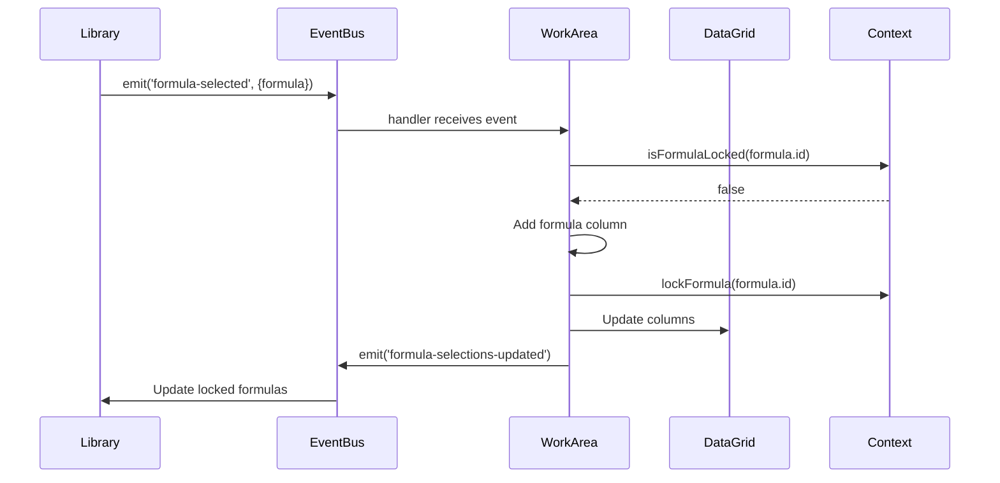

# Formula Management Feature

## Overview

The Formula Management feature enables perfumers to create, edit, version, and manage fragrance formulas. It provides a complete lifecycle management system with multi-formula comparison, versioning, and activation controls.

## User Stories

### US-001: View Formula Library

**As a** perfumer  
**I want to** view all available formulas in the library  
**So that** I can browse existing formulas and select ones to work with

**Acceptance Criteria:**

- Formula library displays all available formulas
- Each formula shows: name, version, status, creator, last updated date
- Formulas are searchable by name, ID, or description
- Visual status indicators (draft, active, archived)
- Formula count badge displayed in header

---

### US-002: Select Formula for Workspace

**As a** perfumer  
**I want to** select a formula from the library and add it to my workspace  
**So that** I can work with and modify the formula

**Acceptance Criteria:**

- User can click formula in library panel
- Formula modal opens with details
- User can confirm selection
- Formula added as a column in the DataGrid
- Formula locked to current workspace
- Other workspaces cannot edit the same formula
- Success notification displayed

---

### US-003: Create New Formula

**As a** perfumer  
**I want to** create a new formula with basic information  
**So that** I can start composing a new fragrance

**Acceptance Criteria:**

- User clicks "+ Formula" button in DataGrid
- Formula creation modal opens
- User enters: name (required), category, description, creator
- Category dropdown includes: Eau de Toilette, Eau de Parfum, Eau de Cologne, Parfum, Eau Fraiche
- System generates unique formula ID
- New formula initialized with v1 version
- Formula status set to "draft"
- Formula added to available formulas list
- Formula automatically added to workspace
- Success notification displayed

---

### US-004: Edit Formula Metadata

**As a** perfumer  
**I want to** edit formula name, category, and description  
**So that** I can keep formula information up to date

**Acceptance Criteria:**

- User accesses formula column menu
- Edit option available for editable formulas
- Modal opens with pre-filled data
- User can modify: name, category, description
- Changes saved to formula object
- Last updated timestamp updated
- Success notification displayed

---

### US-005: Set Active/Editable Formula

**As a** perfumer  
**I want to** set one formula as active for editing  
**So that** I can focus on modifying a single formula

**Acceptance Criteria:**

- User clicks "Set Active" in formula column menu
- Formula column header highlighted (purple border)
- Contribution cost column updates based on active formula
- Badge in header shows active formula name
- Only one formula can be active at a time
- Setting new active formula deactivates previous one

---

### US-006: Create Formula Version

**As a** perfumer  
**I want to** create a new version of an existing formula  
**So that** I can experiment without losing previous work

**Acceptance Criteria:**

- User clicks "Create Version" in formula column menu
- System generates new version number (v1 → v2, etc.)
- New version duplicates current formula composition
- New version gets unique formula ID
- New version added to available formulas
- New version can be added to workspace
- Original version remains unchanged
- Success notification shows new version number

---

### US-007: Normalize Formula

**As a** perfumer  
**I want to** normalize my formula to exactly 100%  
**So that** percentages are correct for production

**Acceptance Criteria:**

- User clicks "Normalize" in formula column menu or header
- System calculates current total percentage
- System calculates scale factor (100 / current total)
- All ingredient percentages multiplied by scale factor
- Values rounded to 5 decimal places
- Target total updated to 100.00000
- Running total displays 100.00000
- Success notification displayed
- Action saved to undo history

---

### US-008: Send Formula for Compounding

**As a** perfumer  
**I want to** submit my formula to the compounding system  
**So that** it can be manufactured

**Acceptance Criteria:**

- User clicks "Send for Compounding" in formula menu or header
- System validates formula:
  - Total percentage equals 100% (±0.01% tolerance)
  - All ingredients have valid values (≥0)
  - At least one ingredient present
  - Formula has name and version
- Validation errors displayed if any
- If valid, formula data prepared for submission
- Audit trail entry created
- API call to Pega DX compounding endpoint (future)
- Submission ID returned
- Formula status updated to "submitted"
- Success notification with submission ID
- Formula locked from further editing

---

### US-009: Remove Formula from Workspace

**As a** perfumer  
**I want to** remove a formula column from my workspace  
**So that** I can declutter my view

**Acceptance Criteria:**

- User clicks "Delete Column" in formula column menu
- Confirmation dialog appears
- User confirms deletion
- Formula column removed from DataGrid
- Formula unlocked from workspace
- Formula available for use in other workspaces
- Action saved to undo history
- Success notification displayed

---

### US-010: View Formula Metrics

**As a** perfumer  
**I want to** see key metrics for the active formula  
**So that** I can assess its composition

**Acceptance Criteria:**

- Metrics displayed in header for active formula:
  - Current total percentage
  - Target total (100.00000)
  - Raw Material Cost (RMC)
  - Number of ingredient lines
- Metrics update in real-time as formula changes
- Color-coded indicators:
  - Green: Total = 100%
  - Orange: Total ≠ 100%
  - Red: Total < 0 or > 200%

---

## Technical Implementation

### File Structure

| File Path | Responsibility | Lines |
|-----------|---------------|-------|
| `src/components/FormulaModal.tsx` | Formula creation/selection UI | 284 |
| `src/components/FormulaList.tsx` | Formula library display | ~200 |
| `src/view/WorkArea/hooks/useFormulaOperations.ts` | Formula business logic | ~180 |
| `src/view/WorkArea/components/FormulaColumnHandlers.tsx` | Column menu operations | ~300 |
| `src/view/WorkArea/components/FormulaMetrics.tsx` | Metrics calculation and display | ~120 |
| `src/services/pega.ts` | Formula data service | 502 |
| `src/utils/formulaCalculations.ts` | Formula calculations | ~200 |
| `src/utils/formulaNaming.ts` | Versioning logic | ~100 |
| `src/utils/formulaIdGenerator.ts` | ID generation | ~50 |
| `src/mocks/formulas.ts` | Mock formula data | ~150 |

### Data Models

```typescript
// Core Formula Interface
interface Formula {
  id: string;                    // Unique identifier (e.g., "F001")
  name: string;                  // Formula name
  version: string;               // Version (e.g., "v1", "v2")
  status: 'draft' | 'active' | 'archived' | 'submitted';
  createdBy: string;             // Creator username
  lastUpdated: string;           // ISO date string
  category: string;              // Fragrance category
  projectName?: string;          // Optional project association
  projectId?: string;            // Optional project ID
  totalPercentage: number;       // Current total (0-100)
  costPerKg?: number;            // Cost per kilogram
  ingredients: FormulaIngredient[]; // Formula composition
  notes: {                       // Olfactive pyramid
    top: string[];
    middle: string[];
    base: string[];
  };
  description: string;           // Formula description
}

// Formula Ingredient
interface FormulaIngredient {
  ingredientId: string;          // Reference to ingredient
  name: string;                  // Ingredient name
  percentage: number;            // Percentage in formula (0-100)
  type: string;                  // Ingredient type
  notes?: string;                // Optional notes
}

// DataGrid Column (Formula)
interface FormulaColumn extends Column {
  id: string;                    // Column ID
  key: string;                   // Data key (matches formula ID)
  formulaId: string;             // Reference to formula
  title: string;                 // Display title (formula name + version)
  type: 'number';                // Column type
  group: 'Formulas';             // Column group
  editable: boolean;             // Can edit cells
  sortable: boolean;             // Can sort
  width: number;                 // Column width
}
```

### State Management

```typescript
// WorkArea State
const [formulas, setFormulas] = useState<Formula[]>([]);
const [availableFormulas, setAvailableFormulas] = useState<Formula[]>([]);
const [activeFormula, setActiveFormula] = useState<Formula | null>(null);
const [editableFormula, setEditableFormula] = useState<string | null>(null);
const [selectedFormulaIds, setSelectedFormulaIds] = useState<string[]>([]);

// Workspace Context (Global)
const {
  lockFormula,
  unlockFormula,
  isFormulaLocked,
  getFormulaLockedInWorkspace
} = useWorkspace();
```

### Key Operations

#### 1. Add Formula to Workspace

```typescript
const handleFormulaSelected = (data: { formula: Formula }) => {
  const formula = data.formula;
  
  // Check if formula is locked in another workspace
  if (isFormulaLocked(formula.id)) {
    const workspaceName = getFormulaLockedInWorkspace(formula.id);
    toast.error(`Formula locked in workspace "${workspaceName}"`);
    return;
  }
  
  // Check if already selected
  if (selectedFormulaIds.includes(formula.id)) {
    toast.error('Formula already in workspace');
    return;
  }
  
  // Check max selections
  if (selectedFormulaIds.length >= maxFormulaSelections) {
    toast.error(`Maximum ${maxFormulaSelections} formulas allowed`);
    return;
  }
  
  // Add column to DataGrid
  const newColumn: Column = {
    id: formula.id,
    key: formula.id,
    formulaId: formula.id,
    title: `${formula.name} ${formula.version}`,
    type: 'number',
    group: 'Formulas',
    editable: true,
    sortable: true,
    width: 120,
  };
  
  // Insert before "+ Formula" column
  const formulaAddIndex = columns.findIndex(c => c.id === 'formulaAdd');
  const updatedColumns = [
    ...columns.slice(0, formulaAddIndex),
    newColumn,
    ...columns.slice(formulaAddIndex),
  ];
  
  setColumns(updatedColumns);
  setSelectedFormulaIds([...selectedFormulaIds, formula.id]);
  setEditableFormula(formula.id);
  
  // Lock formula in workspace
  lockFormula(formula.id);
  
  // Initialize column data (all zeros)
  const updatedData = tableData.map(row => ({
    ...row,
    [formula.id]: row.isTotal ? null : 0,
  }));
  
  setTableData(updatedData);
  
  // Emit events
  eventBus.emit('formula-selections-updated', {
    count: selectedFormulaIds.length + 1,
    selectedIds: [...selectedFormulaIds, formula.id],
  });
  
  toast.success(`Formula "${formula.name}" added`);
};
```

#### 2. Create New Formula

```typescript
const handleCreateFormula = async (formulaData: Omit<Formula, 'id'>) => {
  // Generate unique ID
  const newId = generateNewFormulaId(availableFormulas);
  
  // Create formula object
  const newFormula: Formula = {
    ...formulaData,
    id: newId,
    version: 'v1',
    status: 'draft',
    lastUpdated: new Date().toISOString().split('T')[0],
    totalPercentage: 0,
    ingredients: [],
    notes: { top: [], middle: [], base: [] },
  };
  
  // Save to service (API call in future)
  const savedFormula = await PegaService.createFormula(newFormula);
  
  // Update available formulas
  setAvailableFormulas([...availableFormulas, savedFormula]);
  
  // Emit event
  eventBus.emit('available-formulas-updated', {
    formulas: [...availableFormulas, savedFormula],
  });
  
  // Add to workspace
  handleFormulaSelected({ formula: savedFormula });
  
  toast.success(`Formula "${newFormula.name}" created`);
};
```

#### 3. Create Formula Version

```typescript
const handleCreateVersion = (columnId: string) => {
  const formula = availableFormulas.find(f => f.id === columnId);
  if (!formula) return;
  
  // Parse version number
  const versionMatch = formula.version.match(/v(\d+)/);
  const currentVersion = versionMatch ? parseInt(versionMatch[1]) : 1;
  const newVersion = `v${currentVersion + 1}`;
  
  // Generate new ID
  const newId = generateNewFormulaId(availableFormulas);
  
  // Get current ingredient composition
  const ingredientRows = tableData.filter(row => !row.isTotal && !row.isFormula);
  const ingredients: FormulaIngredient[] = ingredientRows
    .filter(row => (row[columnId] || 0) > 0)
    .map(row => ({
      ingredientId: row.id,
      name: row.description,
      percentage: parseFloat(row[columnId]) || 0,
      type: row.type || 'unknown',
    }));
  
  // Create new version
  const newFormula: Formula = {
    ...formula,
    id: newId,
    version: newVersion,
    lastUpdated: new Date().toISOString().split('T')[0],
    ingredients,
    totalPercentage: ingredients.reduce((sum, ing) => sum + ing.percentage, 0),
  };
  
  // Save new version
  setAvailableFormulas([...availableFormulas, newFormula]);
  
  // Emit event
  eventBus.emit('available-formulas-updated', {
    formulas: [...availableFormulas, newFormula],
  });
  
  toast.success(`Version ${newVersion} created from ${formula.name}`);
};
```

#### 4. Normalize Formula

```typescript
const handleNormalize = (columnId?: string) => {
  const targetColumnId = columnId || editableFormula;
  if (!targetColumnId) {
    toast.error('No formula selected for normalization');
    return;
  }
  
  // Calculate current total
  const ingredientRows = tableData.filter(row => !row.isTotal && !row.isFormula);
  const currentTotal = ingredientRows.reduce((sum, row) => {
    return sum + (parseFloat(row[targetColumnId]) || 0);
  }, 0);
  
  if (currentTotal === 0) {
    toast.error('Cannot normalize: formula total is zero');
    return;
  }
  
  // Calculate scale factor
  const scaleFactor = 100 / currentTotal;
  
  // Apply normalization
  const normalizedData = tableData.map(row => {
    if (row.isTotal) {
      if (row.totalType === 'running' || row.totalType === 'target') {
        return { ...row, [targetColumnId]: 100.00000 };
      }
      return row;
    }
    
    if (row.isFormula) return row;
    
    const currentValue = parseFloat(row[targetColumnId]) || 0;
    const normalizedValue = parseFloat((currentValue * scaleFactor).toFixed(5));
    
    return {
      ...row,
      [targetColumnId]: normalizedValue,
    };
  });
  
  setTableData(normalizedData);
  
  // Recalculate contribution costs if this is active formula
  if (targetColumnId === editableFormula) {
    const recalculated = recalculateContributionCosts(normalizedData, targetColumnId);
    setTableData(calculateTotals(recalculated, columns, [targetColumnId]));
  }
  
  toast.success('Formula normalized to 100%');
};
```

### Event Flow



### Validation Rules

#### Formula Creation

- **Name**: Required, 3-100 characters, must be unique
- **Version**: Auto-generated, format "v{number}"
- **Category**: Required, must be from predefined list
- **Status**: Default "draft", must be valid enum value

#### Formula Normalization

- **Total > 0**: Cannot normalize if total is zero
- **Has Ingredients**: At least one ingredient with value > 0
- **Target Total**: Always 100.00000 after normalization
- **Precision**: Values rounded to 5 decimal places

#### Compounding Submission

- **Total = 100%**: Must equal 100.00000 (±0.01% tolerance)
- **No Negatives**: All ingredient values ≥ 0
- **Has Ingredients**: At least one ingredient
- **Has Metadata**: Name and version required
- **Status**: Must be "draft" or "active"

### Performance Considerations

- **Formula List Virtualization**: Handle 1000+ formulas efficiently
- **Column Limit**: Maximum 4 formula columns to prevent performance degradation
- **Calculation Caching**: Memoize expensive calculations
- **Debounced Updates**: Prevent excessive re-renders during edits
- **Lazy Loading**: Load formula details on-demand

### Integration Points

#### Pega DX API (Future)

```typescript
// Get all formulas
GET /api/data/v1/formulas
Response: { formulas: Formula[] }

// Create formula
POST /api/data/v1/formulas
Body: Omit<Formula, 'id'>
Response: { formula: Formula }

// Update formula
PUT /api/data/v1/formulas/{id}
Body: Partial<Formula>
Response: { formula: Formula }

// Create version
POST /api/data/v1/formulas/{id}/versions
Response: { formula: Formula }

// Submit for compounding
POST /api/compound/v1/submissions
Body: { formula: CompoundingFormula }
Response: { submissionId: string }
```

### Related Features

- [Ingredient Management](./INGREDIENT_MANAGEMENT.md) - Add ingredients to formulas
- [DataGrid Operations](./DATAGRID_OPERATIONS.md) - Edit formula values
- [Workspace Management](./WORKSPACE_MANAGEMENT.md) - Multi-workspace support
- [Compounding](./COMPOUNDING.md) - Submit formulas for production
- [Dilution](./DILUTION.md) - Ingredient dilution in formulas

### Testing Checklist

- [ ] Create new formula with valid data
- [ ] Create formula with duplicate name (should fail)
- [ ] Select existing formula from library
- [ ] Select formula already in workspace (should fail)
- [ ] Select formula locked in another workspace (should fail)
- [ ] Set formula as active/editable
- [ ] Edit formula metadata
- [ ] Create new version from existing formula
- [ ] Normalize formula to 100%
- [ ] Normalize formula with zero total (should fail)
- [ ] Send valid formula for compounding
- [ ] Send invalid formula (total ≠ 100%) for compounding (should fail)
- [ ] Remove formula column from workspace
- [ ] View formula metrics in header
- [ ] Switch between workspaces with different formulas
- [ ] Undo formula operations
- [ ] Formula persists after workspace switch

### Accessibility

- **Keyboard Navigation**: Tab through formula list, Enter to select
- **Screen Reader**: ARIA labels on all buttons and inputs
- **Focus Management**: Focus returns to trigger after modal close
- **Contrast**: WCAG AA compliant color contrast
- **Error Messages**: Clear, actionable error descriptions

### Known Limitations

- Maximum 4 formulas per workspace
- Formula names cannot contain special characters
- Version history limited to 100 versions per formula
- No bulk formula operations
- No formula comparison view (planned)
- No collaborative editing (planned)

### Future Enhancements

- [ ] Formula templates library
- [ ] Duplicate formula feature
- [ ] Import/export formulas (JSON, Excel)
- [ ] Formula comparison side-by-side
- [ ] Collaborative editing with conflict resolution
- [ ] Formula approval workflow
- [ ] Cost analysis and optimization suggestions
- [ ] Regulatory compliance checking per market
- [ ] AI-powered ingredient substitution suggestions
- [ ] Formula history timeline view
- [ ] Formula performance analytics
- [ ] Batch formula operations
