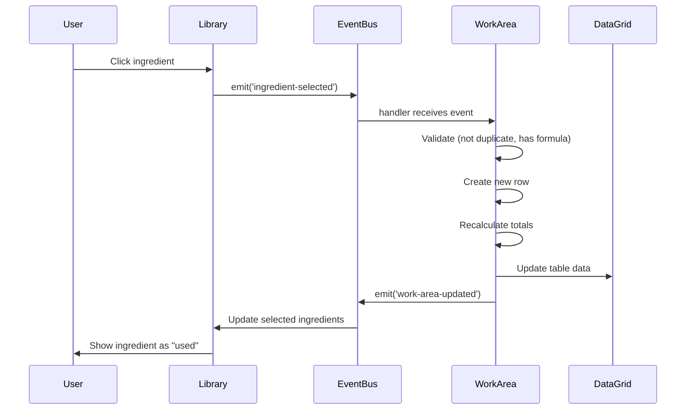

# Ingredient Management Feature

## Overview

The Ingredient Management feature provides a comprehensive system for browsing, searching, filtering, and adding ingredients to formulas. It includes a rich ingredient library with detailed information, advanced filtering capabilities, and quick access to ingredient properties.

## User Stories

### US-020: Browse Ingredient Library

**As a** perfumer  
**I want to** browse all available ingredients in the library  
**So that** I can discover ingredients for my formulas

**Acceptance Criteria:**

- Library panel displays all ingredients
- Each ingredient card shows: name, code, price, type, supplier, status
- Ingredients organized in scrollable list
- Visual indicators for ingredient type (natural/synthetic/base)
- Status badges (active, palette, analytical, etc.)
- Ingredient count displayed
- Already-used ingredients marked/highlighted

---

### US-021: Search Ingredients

**As a** perfumer  
**I want to** search for ingredients by name, code, or CAS number  
**So that** I can quickly find specific ingredients

**Acceptance Criteria:**

- Search bar at top of library panel
- Search is case-insensitive
- Searches across: name, ingredient code, CAS number, supplier
- Results update in real-time (300ms debounce)
- Clear search button visible when query present
- Search term highlighted in results
- No results message when search returns empty
- Search persists during tab switches

---

### US-022: Filter by Ingredient Type

**As a** perfumer  
**I want to** filter ingredients by type (natural, synthetic, base)  
**So that** I can narrow down my ingredient choices

**Acceptance Criteria:**

- Quick filter buttons: All, Natural, Synthetic, Bases
- Active filter highlighted
- Filter count shows results
- Filters work in combination with search
- Filter state persists during session
- Clear filters button available

---

### US-023: Advanced Filtering

**As a** perfumer  
**I want to** use advanced filters with multiple conditions  
**So that** I can find ingredients matching specific criteria

**Acceptance Criteria:**

- "Advanced Filters" button opens filter builder
- QueryBuilder UI with rules and groups
- Support for AND/OR combinators
- Available fields: type, price, MAC, supplier, category, olfactive family, origin, volatility
- Operators: equals, not equals, contains, greater than, less than, between
- Add/remove rules dynamically
- Add/remove groups for complex queries
- Apply button executes filter
- Clear button resets all filters
- Filter summary displayed when active
- Filters saved during session

---

### US-024: View Ingredient Quick Info

**As a** perfumer  
**I want to** see quick information about an ingredient  
**So that** I can make informed decisions without opening full details

**Acceptance Criteria:**

- Hover over ingredient shows tooltip/quick view
- Quick view displays:
  - Ingredient name and code
  - CAS number
  - Price per kg
  - Supplier
  - MAC (Maximum Allowable Concentration)
  - Odor profile
  - Volatility
  - Allergens list
  - IFRA category
- Quick view dismisses on mouse out
- Click ingredient opens full details

---

### US-025: View Ingredient Full Details

**As a** perfumer  
**I want to** view complete ingredient information  
**So that** I can understand all properties and compliance data

**Acceptance Criteria:**

- Click ingredient opens detail modal/panel
- Tabbed interface with sections:
  - **Overview**: Basic info, description, odor profile
  - **Chemical Properties**: CAS, EINECS, FEMA, molecular data
  - **Physical Properties**: Density, boiling point, flash point, solubility
  - **Chemical Structure**: Molecular diagram, SMILES notation
  - **Compliance**: IFRA limits, allergens, restrictions by market
  - **Suppliers**: List of suppliers with pricing
  - **Documents**: SDSs, COAs, tech sheets
- Full-screen or side panel layout option
- Print/export ingredient data
- Close button returns to library

---

### US-026: Add Ingredient to Formula

**As a** perfumer  
**I want to** add an ingredient to my active formula  
**So that** I can build my composition

**Acceptance Criteria:**

- "+" button visible on ingredient card
- Click "+" adds ingredient to active formula
- If no active formula, prompt to create/select one
- If ingredient already in formula, show notification
- Ingredient added with default value (0 or 1.0g)
- DataGrid row added for ingredient
- Ingredient marked as "used" in library
- Success notification displayed
- Action saved to undo history

---

### US-027: Remove Ingredient from Formula

**As a** perfumer  
**I want to** remove an ingredient from my formula  
**So that** I can refine my composition

**Acceptance Criteria:**

- Delete icon visible on DataGrid rows
- Click delete shows confirmation dialog
- Confirm removes ingredient row
- Ingredient unmarked as "used" in library
- Formula totals recalculated
- Success notification displayed
- Action saved to undo history

---

### US-028: View Ingredient Usage

**As a** perfumer  
**I want to** see which ingredients are currently in my formulas  
**So that** I can track my ingredient usage

**Acceptance Criteria:**

- Used ingredients highlighted in library
- Badge shows usage count (if in multiple formulas)
- Filter option to show only used/unused ingredients
- Used ingredients listed in workspace summary

---

### US-029: Sort Ingredient List

**As a** perfumer  
**I want to** sort ingredients by different criteria  
**So that** I can organize the list according to my needs

**Acceptance Criteria:**

- Sort options: Name (A-Z, Z-A), Price (Low-High, High-Low), Type, Supplier
- Sort dropdown in library header
- Active sort indicated
- Sort persists during session
- Sort works with filters and search

---

## Technical Implementation

### File Structure

| File Path | Responsibility | Lines |
|-----------|---------------|-------|
| `src/components/IngredientList.tsx` | Ingredient library display | ~250 |
| `src/components/IngredientQuickView.tsx` | Quick info panel | ~300 |
| `src/components/IngredientTable.tsx` | Full ingredient table view | ~200 |
| `src/components/IngredientSections/*.tsx` | Detail section components | ~150 each |
| `src/components/SearchBar.tsx` | Search input component | ~100 |
| `src/components/QueryBuilder.tsx` | Advanced filter builder | ~400 |
| `src/components/AdvancedFilterSheet.tsx` | Filter sheet UI | ~250 |
| `src/view/Library/LibraryPanel.tsx` | Library panel container | 304 |
| `src/services/pega.ts` | Ingredient data service | 502 |
| `src/utils/queryEvaluator.ts` | Filter evaluation logic | ~200 |
| `src/mocks/ingredients.ts` | Mock ingredient data | ~500 |

### Data Models

```typescript
// Core Ingredient Interface
interface Ingredient {
  id: string;                      // Unique identifier (e.g., "INGR8007758")
  name: string;                    // Ingredient name
  code: string;                    // Ingredient code
  price: number;                   // Price per kg
  unit: string;                    // Unit (kg, g, ml)
  type: 'natural' | 'synthetic' | 'base';
  category: string;                // Category (Essential Oils, Synthetics, etc.)
  supplier: string;                // Primary supplier
  status: 'active' | 'inactive' | 'palette' | 'analytical' | 'sers_review';
  mac: number;                     // Maximum Allowable Concentration (%)
  odorProfile?: string;            // Odor description
  volatility?: string;             // Top/Middle/Base note
  allergens?: string[];            // List of allergens
  ifraCategory?: string;           // IFRA restriction category
  casNumber?: string;              // CAS registry number
  einecs?: string;                 // EINECS number
  fema?: string;                   // FEMA number
  description?: string;            // Full description
  
  // Extended properties (loaded on-demand)
  physicalProperties?: {
    density?: number;
    boilingPoint?: number;
    flashPoint?: number;
    solubility?: string;
    appearance?: string;
  };
  
  chemicalProperties?: {
    molecularFormula?: string;
    molecularWeight?: number;
    smiles?: string;
    inchi?: string;
  };
  
  compliance?: {
    ifraLimits?: Record<string, number>;
    reach?: string;
    tsca?: string;
    chinaCatalogue?: boolean;
  };
  
  suppliers?: Array<{
    name: string;
    price: number;
    leadTime: number;
    minOrder: number;
  }>;
  
  documents?: Array<{
    type: 'SDS' | 'COA' | 'TechSheet' | 'Other';
    name: string;
    url: string;
    date: string;
  }>;
}

// Filter Query Structure
interface FilterGroup {
  id: string;
  combinator: 'and' | 'or';
  rules: Array<FilterRule | FilterGroup>;
}

interface FilterRule {
  id: string;
  field: string;
  operator: 'equals' | 'notEquals' | 'contains' | 'greaterThan' | 'lessThan' | 'between';
  value: any;
}
```

### State Management

```typescript
// Library Panel State
const [ingredients, setIngredients] = useState<Ingredient[]>([]);
const [searchQuery, setSearchQuery] = useState<string>('');
const [activeFilter, setActiveFilter] = useState<string>('all');
const [currentQuery, setCurrentQuery] = useState<FilterGroup>(emptyQuery);
const [selectedIngredients, setSelectedIngredients] = useState<string[]>([]);
const [showAdvancedFilters, setShowAdvancedFilters] = useState(false);

// Derived state
const filteredIngredients = useMemo(() => {
  return ingredients.filter(ing => {
    const matchesSearch = !searchQuery || 
      ing.name.toLowerCase().includes(searchQuery.toLowerCase()) ||
      ing.code.toLowerCase().includes(searchQuery.toLowerCase()) ||
      ing.casNumber?.includes(searchQuery);
    
    const matchesTypeFilter = activeFilter === 'all' ||
      (activeFilter === 'natural' && ing.type === 'natural') ||
      (activeFilter === 'synthetic' && ing.type === 'synthetic') ||
      (activeFilter === 'bases' && ing.type === 'base');
    
    const matchesAdvancedQuery = evaluateQuery(ing, currentQuery);
    
    return matchesSearch && matchesTypeFilter && matchesAdvancedQuery;
  });
}, [ingredients, searchQuery, activeFilter, currentQuery]);
```

### Key Operations

#### 1. Search Ingredients

```typescript
const handleSearch = useMemo(
  () => debounce((query: string) => {
    setSearchQuery(query);
    
    // Track search in analytics
    if (query.length >= 3) {
      trackEvent('ingredient_search', { query });
    }
  }, 300),
  []
);
```

#### 2. Apply Advanced Filters

```typescript
const handleApplyFilters = (query: FilterGroup) => {
  setCurrentQuery(query);
  setShowAdvancedFilters(false);
  
  // Count filtered results
  const resultCount = ingredients.filter(ing => 
    evaluateQuery(ing, query)
  ).length;
  
  toast.success(`${resultCount} ingredients match filters`);
};

// Query Evaluation
const evaluateQuery = (ingredient: Ingredient, query: FilterGroup): boolean => {
  if (!query.rules || query.rules.length === 0) return true;
  
  const results = query.rules.map(rule => {
    if ('combinator' in rule) {
      // Nested group
      return evaluateQuery(ingredient, rule);
    }
    
    // Evaluate individual rule
    const fieldValue = ingredient[rule.field];
    
    switch (rule.operator) {
      case 'equals':
        return fieldValue === rule.value;
      case 'notEquals':
        return fieldValue !== rule.value;
      case 'contains':
        return String(fieldValue).toLowerCase().includes(
          String(rule.value).toLowerCase()
        );
      case 'greaterThan':
        return Number(fieldValue) > Number(rule.value);
      case 'lessThan':
        return Number(fieldValue) < Number(rule.value);
      case 'between':
        return Number(fieldValue) >= rule.value[0] && 
               Number(fieldValue) <= rule.value[1];
      default:
        return true;
    }
  });
  
  // Apply combinator
  return query.combinator === 'and'
    ? results.every(Boolean)
    : results.some(Boolean);
};
```

#### 3. Add Ingredient to Formula

```typescript
const handleIngredientClick = (data: { ingredient: Ingredient }) => {
  const ingredient = data.ingredient;
  
  // Check if active formula exists
  if (!editableFormula) {
    toast.error('Please select or create a formula first');
    return;
  }
  
  // Check if ingredient already exists
  const existingRow = tableData.find(
    row => row.id === ingredient.id && !row.isTotal
  );
  
  if (existingRow) {
    toast.error(`${ingredient.name} already in formula`);
    return;
  }
  
  // Ensure initial state is saved
  ensureInitialStateSaved();
  
  // Create new ingredient row
  const newRow = {
    id: ingredient.id,
    description: ingredient.name,
    costKg: ingredient.price,
    contCost: 0, // Will be calculated based on formula percentage
    type: ingredient.type,
    supplier: ingredient.supplier,
    mac: ingredient.mac,
    odorProfile: ingredient.odorProfile,
    volatility: ingredient.volatility,
    // Initialize all formula columns with 0
    ...selectedFormulaIds.reduce((acc, formulaId) => ({
      ...acc,
      [formulaId]: 0,
    }), {}),
  };
  
  // Insert before total rows
  const ingredientRows = tableData.filter(row => !row.isTotal);
  const totalRows = tableData.filter(row => row.isTotal);
  const updatedData = [...ingredientRows, newRow, ...totalRows];
  
  // Recalculate totals
  const finalData = calculateTotals(updatedData, columns, selectedFormulaIds);
  
  setTableData(finalData);
  
  // Update selected ingredients list
  setSelectedIngredients([...selectedIngredients, ingredient.id]);
  
  // Emit event for library to update
  eventBus.emit('work-area-updated', {
    ingredients: [...selectedIngredients, ingredient.id],
  });
  
  // Save state for undo
  saveStateAfterAction('add_ingredient', `Added ${ingredient.name}`);
  
  toast.success(`${ingredient.name} added to formula`);
};
```

#### 4. Load Ingredient Details

```typescript
const loadIngredientDetails = async (ingredientId: string) => {
  try {
    // Show loading state
    setLoadingDetails(true);
    
    // Fetch full details from API
    const details = await PegaService.getIngredientDetails(ingredientId);
    
    // Update ingredient in state
    setIngredients(prevIngredients =>
      prevIngredients.map(ing =>
        ing.id === ingredientId
          ? { ...ing, ...details }
          : ing
      )
    );
    
    return details;
  } catch (error) {
    console.error('Failed to load ingredient details:', error);
    toast.error('Failed to load ingredient details');
    return null;
  } finally {
    setLoadingDetails(false);
  }
};
```

### Event Flow



### Search and Filter Performance

```typescript
// Debounced search for performance
const debouncedSearch = useMemo(
  () => debounce((query: string) => {
    setSearchQuery(query);
  }, 300),
  []
);

// Memoized filtering
const filteredIngredients = useMemo(() => {
  // Filter logic here
}, [ingredients, searchQuery, activeFilter, currentQuery]);

// Virtualized list for large datasets
<VirtualList
  items={filteredIngredients}
  itemHeight={80}
  overscan={5}
  renderItem={(ingredient) => (
    <IngredientCard ingredient={ingredient} />
  )}
/>
```

### Integration Points

#### Pega DX API (Future)

```typescript
// Get all ingredients
GET /api/data/v1/ingredients
Query: ?type=natural&status=active&limit=100&offset=0
Response: { ingredients: Ingredient[], total: number }

// Search ingredients
GET /api/data/v1/ingredients/search
Query: ?q=bergamot&fields=name,code,casNumber
Response: { results: Ingredient[] }

// Get ingredient details
GET /api/data/v1/ingredients/{id}
Response: { ingredient: Ingredient }

// Get ingredient suppliers
GET /api/data/v1/ingredients/{id}/suppliers
Response: { suppliers: Supplier[] }

// Get ingredient documents
GET /api/data/v1/ingredients/{id}/documents
Response: { documents: Document[] }
```

### Related Features

- [Formula Management](./FORMULA_MANAGEMENT.md) - Add ingredients to formulas
- [DataGrid Operations](./DATAGRID_OPERATIONS.md) - Edit ingredient values
- [Dilution](./DILUTION.md) - Dilute ingredients with solvents
- [Compounding](./COMPOUNDING.md) - Submit ingredients for production

### Testing Checklist

- [ ] Browse all ingredients
- [ ] Search by ingredient name
- [ ] Search by ingredient code
- [ ] Search by CAS number
- [ ] Filter by type (natural, synthetic, base)
- [ ] Apply single advanced filter rule
- [ ] Apply multiple rules with AND combinator
- [ ] Apply multiple rules with OR combinator
- [ ] Apply nested filter groups
- [ ] Clear all filters
- [ ] View ingredient quick view on hover
- [ ] View ingredient full details modal
- [ ] Add ingredient to active formula
- [ ] Add ingredient when no formula active (should fail)
- [ ] Add duplicate ingredient (should fail)
- [ ] Remove ingredient from formula
- [ ] See ingredient marked as "used" after adding
- [ ] Sort ingredients by name
- [ ] Sort ingredients by price
- [ ] Combine search + filters
- [ ] Ingredient data persists on tab switch

### Accessibility

- **Keyboard Navigation**: Tab through ingredient list, Enter to select, Space to toggle
- **Screen Reader**: ARIA labels on all ingredient cards and buttons
- **Focus Management**: Focus trapped in modals, returns to trigger on close
- **Contrast**: WCAG AA compliant colors for badges and status indicators
- **Tooltips**: Accessible tooltips with role="tooltip" and aria-describedby

### Performance Considerations

- **Virtual Scrolling**: List virtualizes for 1000+ ingredients
- **Debounced Search**: 300ms delay to reduce re-renders
- **Memoized Filters**: Filter results cached until dependencies change
- **Lazy Loading**: Full details loaded on-demand
- **Image Optimization**: Ingredient images lazy-loaded with placeholders
- **Pagination**: API supports pagination for large datasets

### Known Limitations

- Maximum 1000 ingredients displayed without pagination
- Search limited to name, code, CAS (not full-text)
- Advanced filters limited to 10 rules per group
- No fuzzy matching in search
- No ingredient substitution suggestions (planned)
- No ingredient comparison view (planned)

### Future Enhancements

- [ ] Ingredient favorites/bookmarks
- [ ] Recently used ingredients
- [ ] Ingredient substitution suggestions
- [ ] Bulk ingredient import
- [ ] Custom ingredient creation
- [ ] Ingredient cost history chart
- [ ] Supplier inventory integration
- [ ] Ingredient comparison side-by-side
- [ ] AI-powered ingredient discovery
- [ ] Ingredient usage analytics
- [ ] Ingredient sourcing recommendations
- [ ] Allergen impact analysis
