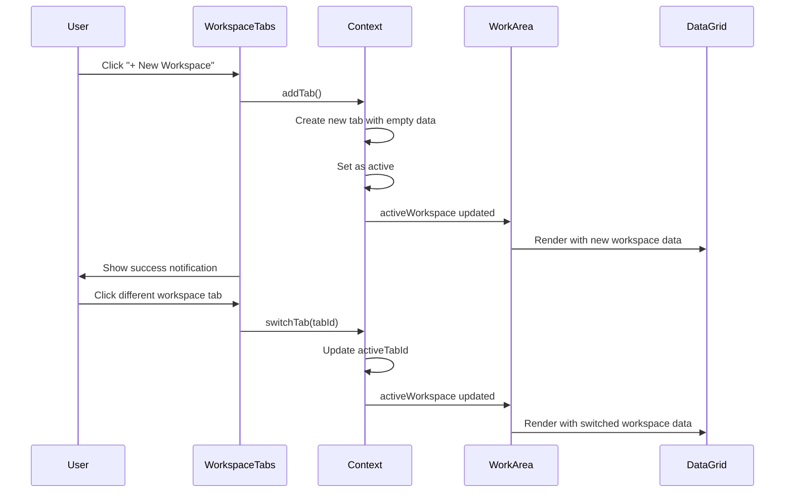

# Workspace Management Feature

## Overview

The Workspace Management feature enables users to work with multiple independent workspace sessions simultaneously. Each workspace maintains its own isolated state including formulas, ingredients, and grid configuration, allowing perfumers to work on different projects or compare different approaches side-by-side.

## User Stories

### US-060: View Active Workspace

**As a** perfumer  
**I want to** see which workspace I'm currently working in  
**So that** I can keep track of my sessions

**Acceptance Criteria:**

- Active workspace tab highlighted with distinct color (purple)
- Workspace name displayed prominently
- Active indicator (colored border) on tab
- Last modified timestamp visible on hover
- Folder icon indicates workspace type

---

### US-061: Create New Workspace

**As a** perfumer  
**I want to** create a new workspace  
**So that** I can work on multiple projects simultaneously

**Acceptance Criteria:**

- "+" button or menu option to add workspace
- Maximum 3 workspaces allowed
- New workspace gets default name "Workspace {N}"
- New workspace starts with clean state (no formulas/ingredients)
- Default column structure initialized
- New workspace becomes active automatically
- Success notification displayed
- Workspace limit warning if at maximum

---

### US-062: Switch Between Workspaces

**As a** perfumer  
**I want to** switch between my workspaces  
**So that** I can work on different projects

**Acceptance Criteria:**

- Click workspace tab to switch
- Current workspace state saved automatically
- New workspace state loaded immediately
- Grid updates with new workspace data
- Header badges update to reflect new workspace
- Locked formulas in other workspaces remain locked
- Smooth transition animation
- Previous workspace remains unchanged

---

### US-063: Rename Workspace

**As a** perfumer  
**I want to** rename my workspace  
**So that** I can identify it easily

**Acceptance Criteria:**

- Double-click workspace tab to rename
- Or use "Rename" option in workspace menu
- Inline text input appears
- Enter saves new name
- Escape cancels rename
- Name limited to 20 characters
- Empty name not allowed, reverts to previous
- Last modified timestamp updates
- Success notification displayed

---

### US-064: Close Workspace

**As a** perfumer  
**I want to** close a workspace when I'm done  
**So that** I can declutter my workspace tabs

**Acceptance Criteria:**

- Close button (X) visible on workspace tab
- Cannot close default workspace (Alpha)
- Click close shows confirmation dialog
- Confirm closes workspace
- All formulas in workspace unlocked automatically
- If closing active workspace, switch to first available
- Workspace state discarded (not saved)
- Success notification with workspace name

---

### US-065: Reset Workspace

**As a** perfumer  
**I want to** reset workspace to clean state  
**So that** I can start fresh without creating new workspace

**Acceptance Criteria:**

- "Reset Workspace" option in menu
- Confirmation dialog warns of data loss
- Confirm clears all formulas and ingredients
- Default column structure restored
- All formulas unlocked
- Grid returns to empty state
- Undo history cleared
- Success notification displayed

---

### US-066: Formula Locking Across Workspaces

**As a** perfumer  
**I want to** formulas to be locked when used in a workspace  
**So that** I don't accidentally edit the same formula in multiple places

**Acceptance Criteria:**

- Formula locked when added to workspace
- Locked formula cannot be added to other workspaces
- Attempt to add locked formula shows error message
- Error message indicates which workspace has the formula
- Formula unlocked when workspace closed
- Formula unlocked when formula column removed
- Lock status visible in formula library

---

### US-067: View Workspace Summary

**As a** perfumer  
**I want to** see summary information about my workspace  
**So that** I can understand what's in it

**Acceptance Criteria:**

- Workspace tab shows basic info on hover:
  - Workspace name
  - Number of formulas
  - Number of ingredients
  - Last modified date/time
- Summary updates in real-time
- Tooltip positioned near cursor

---

### US-068: Workspace State Persistence

**As a** perfumer  
**I want to** my workspace state to persist during my session  
**So that** I don't lose my work when switching workspaces

**Acceptance Criteria:**

- Workspace state saved automatically on changes
- State includes: columns, data, formulas, selected items
- State persists during workspace switches
- State persists during browser tab switches (session storage)
- State cleared on browser close (not localStorage)
- No manual save required

---

### US-069: Workspace Limit Management

**As a** perfumer  
**I want to** be notified when I reach workspace limit  
**So that** I know when to close unused workspaces

**Acceptance Criteria:**

- Add workspace button disabled at limit (3)
- Tooltip explains limit
- Error notification if attempting to exceed limit
- Current count shown: "X/3"
- Suggestion to close unused workspaces

---

## Technical Implementation

### File Structure

| File Path | Responsibility | Lines |
|-----------|---------------|-------|
| `src/context/WorkspaceContext.tsx` | Workspace state provider | 300+ |
| `src/components/workspace/WorkspaceTabs.tsx` | Tab UI component | 200+ |
| `src/hooks/useWorkspace.ts` | Workspace hook | ~100 |
| `src/utils/workspaceManager.ts` | Workspace utilities | ~150 |

### Data Models

```typescript
// Workspace Tab
interface WorkspaceTab {
  id: string;                      // Unique identifier
  name: string;                    // Display name
  lastModified: Date;              // Last modification timestamp
  isDefault: boolean;              // Is default workspace (Alpha)
  data: WorkspaceData;             // Workspace state
}

// Workspace Data (State)
interface WorkspaceData {
  columns: Column[];               // DataGrid columns
  tableData: Record<string, unknown>[]; // Grid data
  selectedFormulaIds: string[];    // Selected formulas
  editableFormula: string | null;  // Active formula
  selectedAttributes: string[];    // Selected attributes
  selectedFormulas: Formula[];     // Formula objects
  formulas: Formula[];             // All formulas
  lockedFormulas: Set<string>;     // Locked formula IDs
}

// Workspace Context API
interface WorkspaceContextType {
  // Tab Management
  tabs: WorkspaceTab[];
  activeTabId: string;
  activeWorkspace: WorkspaceData;
  addTab: () => void;
  closeTab: (tabId: string) => void;
  switchTab: (tabId: string) => void;
  renameTab: (tabId: string, newName: string) => void;

  // Session Management
  resetWorkspace: (tabId: string) => void;
  updateWorkspaceData: (data: Partial<WorkspaceData>) => void;

  // Formula Locking
  isFormulaLocked: (formulaId: string) => boolean;
  getFormulaLockedInWorkspace: (formulaId: string) => string | null;
  lockFormula: (formulaId: string) => void;
  unlockFormula: (formulaId: string) => void;

  // Global Data (shared across workspaces)
  availableFormulas: Formula[];
  ingredients: Ingredient[];
  attributes: IngredientAttribute[];
  setAvailableFormulas: (formulas: Formula[]) => void;
  setIngredients: (ingredients: Ingredient[]) => void;
  setAttributes: (attributes: IngredientAttribute[]) => void;
}
```

### State Management

```typescript
// WorkspaceProvider Implementation
export const WorkspaceProvider: React.FC<{ children: React.ReactNode }> = ({
  children,
}) => {
  const MAX_TABS = 3;
  const DEFAULT_TAB_NAME = "Alpha";

  const [tabs, setTabs] = useState<WorkspaceTab[]>([
    {
      id: "default",
      name: DEFAULT_TAB_NAME,
      lastModified: new Date(),
      isDefault: true,
      data: createEmptyWorkspaceData(),
    },
  ]);

  const [activeTabId, setActiveTabId] = useState("default");

  // Global data shared across all workspaces
  const [availableFormulas, setAvailableFormulas] = useState<Formula[]>([]);
  const [ingredients, setIngredients] = useState<Ingredient[]>([]);
  const [attributes, setAttributes] = useState<IngredientAttribute[]>([]);

  const activeWorkspace =
    tabs.find((tab) => tab.id === activeTabId)?.data ||
    createEmptyWorkspaceData();

  // ... implementation
};
```

### Key Operations

#### 1. Add Workspace

```typescript
const addTab = useCallback(() => {
  if (tabs.length >= MAX_TABS) {
    toast.error(`Maximum of ${MAX_TABS} tabs allowed`);
    return;
  }

  const newTab: WorkspaceTab = {
    id: `tab-${Date.now()}`,
    name: `Workspace ${tabs.length + 1}`,
    lastModified: new Date(),
    isDefault: false,
    data: createEmptyWorkspaceData(),
  };

  setTabs((prev) => [...prev, newTab]);
  setActiveTabId(newTab.id);
  
  toast.success(
    `New workspace "${newTab.name}" created - Fresh session started`
  );
}, [tabs.length]);
```

#### 2. Switch Workspace

```typescript
const switchTab = useCallback((tabId: string) => {
  // Current workspace state is automatically preserved in tabs array
  // No need to explicitly save - React state handles this
  
  setActiveTabId(tabId);
  
  // WorkArea and other components will re-render with new activeWorkspace
  // from context, which pulls data from the newly active tab
}, []);
```

#### 3. Close Workspace

```typescript
const closeTab = useCallback(
  (tabId: string) => {
    const tab = tabs.find((t) => t.id === tabId);
    
    if (tab?.isDefault) {
      toast.error("Cannot close the default workspace");
      return;
    }

    // Unlock all formulas from this workspace
    const tabData = tabs.find((t) => t.id === tabId)?.data;
    if (tabData) {
      tabData.lockedFormulas.clear();
    }

    const updatedTabs = tabs.filter((t) => t.id !== tabId);
    setTabs(updatedTabs);

    // If closing active tab, switch to first tab
    if (activeTabId === tabId) {
      setActiveTabId(updatedTabs[0].id);
    }

    toast.success(`Workspace "${tab?.name}" closed`);
  },
  [tabs, activeTabId]
);
```

#### 4. Rename Workspace

```typescript
const renameTab = useCallback((tabId: string, newName: string) => {
  if (!newName.trim()) return;

  setTabs((prev) =>
    prev.map((tab) =>
      tab.id === tabId
        ? { ...tab, name: newName.trim(), lastModified: new Date() }
        : tab
    )
  );

  toast.success("Workspace renamed");
}, []);
```

#### 5. Reset Workspace

```typescript
const resetWorkspace = useCallback((tabId: string) => {
  setTabs((prev) =>
    prev.map((tab) => {
      if (tab.id === tabId) {
        // Unlock all formulas from this workspace before resetting
        tab.data.lockedFormulas.clear();

        return {
          ...tab,
          data: createEmptyWorkspaceData(),
          lastModified: new Date(),
        };
      }
      return tab;
    })
  );
  
  toast.success("Workspace reset to fresh state");
}, []);
```

#### 6. Update Workspace Data

```typescript
const updateWorkspaceData = useCallback(
  (data: Partial<WorkspaceData>) => {
    setTabs((prev) =>
      prev.map((tab) => {
        if (tab.id === activeTabId) {
          return {
            ...tab,
            data: { ...tab.data, ...data },
            lastModified: new Date(),
          };
        }
        return tab;
      })
    );
  },
  [activeTabId]
);
```

#### 7. Formula Locking

```typescript
// Check if formula is locked in ANY workspace
const isFormulaLocked = useCallback(
  (formulaId: string): boolean => {
    return tabs.some(
      (tab) =>
        tab.id !== activeTabId && tab.data.lockedFormulas.has(formulaId)
    );
  },
  [tabs, activeTabId]
);

// Get workspace name where formula is locked
const getFormulaLockedInWorkspace = useCallback(
  (formulaId: string): string | null => {
    const lockedTab = tabs.find(
      (tab) =>
        tab.id !== activeTabId && tab.data.lockedFormulas.has(formulaId)
    );
    return lockedTab ? lockedTab.name : null;
  },
  [tabs, activeTabId]
);

// Lock formula in current workspace
const lockFormula = useCallback(
  (formulaId: string) => {
    setTabs((prev) =>
      prev.map((tab) => {
        if (tab.id === activeTabId) {
          const newLockedFormulas = new Set(tab.data.lockedFormulas);
          newLockedFormulas.add(formulaId);
          return {
            ...tab,
            data: { ...tab.data, lockedFormulas: newLockedFormulas },
          };
        }
        return tab;
      })
    );
  },
  [activeTabId]
);

// Unlock formula in current workspace
const unlockFormula = useCallback(
  (formulaId: string) => {
    setTabs((prev) =>
      prev.map((tab) => {
        if (tab.id === activeTabId) {
          const newLockedFormulas = new Set(tab.data.lockedFormulas);
          newLockedFormulas.delete(formulaId);
          return {
            ...tab,
            data: { ...tab.data, lockedFormulas: newLockedFormulas },
          };
        }
        return tab;
      })
    );
  },
  [activeTabId]
);
```

### Usage in Components

```typescript
// In WorkArea or other components
const {
  tabs,
  activeTabId,
  activeWorkspace,
  addTab,
  closeTab,
  switchTab,
  renameTab,
  resetWorkspace,
  updateWorkspaceData,
  isFormulaLocked,
  lockFormula,
  unlockFormula,
} = useWorkspace();

// Update workspace data
const handleDataChange = (newData: any[]) => {
  updateWorkspaceData({ tableData: newData });
};

// Check formula lock before adding
const handleAddFormula = (formula: Formula) => {
  if (isFormulaLocked(formula.id)) {
    const workspaceName = getFormulaLockedInWorkspace(formula.id);
    toast.error(`Formula is locked in workspace "${workspaceName}"`);
    return;
  }
  
  // Add formula and lock it
  // ... add formula logic
  lockFormula(formula.id);
};
```

### Event Flow



### State Persistence

Currently, workspace state is managed entirely in React state and is lost on page refresh. Future enhancement could add persistence:

```typescript
// Future: Save to localStorage
useEffect(() => {
  const saveWorkspaces = () => {
    const workspaceState = {
      tabs: tabs.map(tab => ({
        ...tab,
        lastModified: tab.lastModified.toISOString(),
      })),
      activeTabId,
    };
    
    localStorage.setItem('workspaces', JSON.stringify(workspaceState));
  };

  // Debounce saves
  const timeoutId = setTimeout(saveWorkspaces, 1000);
  return () => clearTimeout(timeoutId);
}, [tabs, activeTabId]);

// Future: Load from localStorage on mount
useEffect(() => {
  const loadWorkspaces = () => {
    const saved = localStorage.getItem('workspaces');
    if (saved) {
      const state = JSON.parse(saved);
      setTabs(state.tabs.map(tab => ({
        ...tab,
        lastModified: new Date(tab.lastModified),
      })));
      setActiveTabId(state.activeTabId);
    }
  };

  loadWorkspaces();
}, []);
```

### Related Features

- [Formula Management](./FORMULA_MANAGEMENT.md) - Formula locking
- [DataGrid Operations](./DATAGRID_OPERATIONS.md) - Grid state per workspace
- [State History](./STATE_HISTORY.md) - Undo/redo per workspace

### Testing Checklist

- [ ] Create new workspace (within limit)
- [ ] Create workspace at limit (should fail)
- [ ] Switch between workspaces
- [ ] Rename workspace with double-click
- [ ] Rename workspace from menu
- [ ] Close non-default workspace
- [ ] Attempt to close default workspace (should fail)
- [ ] Reset workspace
- [ ] Add formula to workspace (locks it)
- [ ] Attempt to add locked formula to different workspace (should fail)
- [ ] Remove formula from workspace (unlocks it)
- [ ] Close workspace (unlocks all formulas)
- [ ] Workspace data persists when switching
- [ ] Workspace data independent between tabs
- [ ] View workspace hover tooltip
- [ ] Workspace count updates correctly

### Accessibility

- **Keyboard Navigation**: Tab through workspace tabs, Enter to select
- **ARIA Tabs**: Proper tab/tabpanel roles
- **Focus Management**: Focus on active tab indicated
- **Screen Reader**: Tab names and states announced
- **Shortcuts**: Cmd/Ctrl+1,2,3 to switch workspaces (future)

### Performance Considerations

- **State Updates**: Only active workspace re-renders on data change
- **Memo Hooks**: Workspace operations memoized with useCallback
- **Lazy Evaluation**: Workspace data only computed when active
- **Memory**: Maximum 3 workspaces prevents memory issues

### Known Limitations

- Maximum 3 concurrent workspaces
- No workspace persistence (cleared on page refresh)
- Cannot reorder workspace tabs
- Cannot duplicate workspace
- No workspace templates
- No workspace sharing/export

### Future Enhancements

- [ ] Workspace persistence to localStorage
- [ ] Workspace templates (pre-configured setups)
- [ ] Duplicate workspace
- [ ] Reorder workspace tabs by dragging
- [ ] Workspace shortcuts (Cmd+1, Cmd+2, etc.)
- [ ] Workspace export/import (JSON)
- [ ] Workspace auto-save with recovery
- [ ] Workspace comparison view
- [ ] Collaborative workspaces (multi-user)
- [ ] Workspace history/timeline
- [ ] Workspace search across all tabs
- [ ] Increase workspace limit to 5
- [ ] Workspace-specific settings
